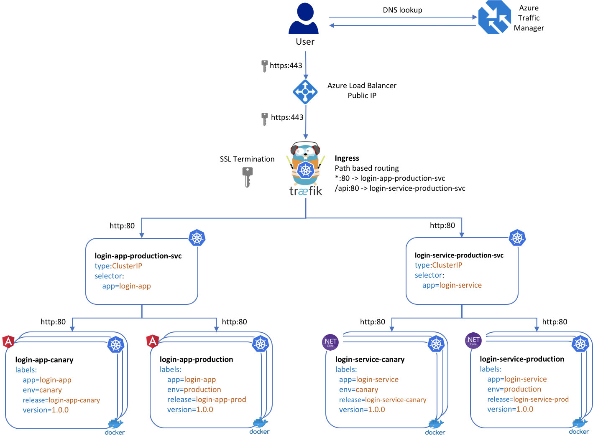

# Traffic Routing

## Azure Traffic Manager

[Azure Traffic Manager](https://azure.microsoft.com/en-us/services/traffic-manager/) provides global DNS endpoint resolution for public requests to the Kubernetes cluster running in Azure. Traffic Manager provides several benefits, including:

- Nearest geographic proximity based routing
- Global failover
- Weighted routing between different clusters

## Azure Load Balancer

An Azure load balancer provides a public IP and the entry point for all public requests to the Kubernetes cluster. The Azure Traffic Manager endpoint for the cluster has a CNAME record pointing to the Azure Load Balancer public IP.

## Traefik Ingress Controller

A [Traefik ingress controller](https://github.com/kubernetes/charts/tree/master/stable/traefik) is used within the Kubernetes cluster for traffic routing. Traefik provides flexibility to describe routes as code and review any routing changes before they are applied. Traefik uses a single public IP on the Azure Load Balancer and handles routing all requests for the k8 services in the Kubernetes cluster based on hostname, paths and/or ports.

**Traefik also handles ssl termination** for the Kubernetes cluster. This enables the SSL certificate to be deployed to a single location and ensures that all traffic will travel over HTTPS into the Kubernestes cluster.

## Kubernetes Services

Traefik routes all requests to Kubernetes services, which act as internal load balancers in Kubernetes. **Since we are using Traefik, the Kubernetes services be of type ClusterIP**, which makes them accessible from within the cluster only and prevents exposing services directly to public requests.

### Canary and production routing

Kubernetes services are provided for canary and production environments. The Kubernetes services selector only filters on the app label, which allows requests to round robin between both canary and production replicas. Because requests are round robined across all pods connected to the service, the amount of traffic going to canary vs production pods is determined by the replica count for each deployment.

For example, with 9 production replicas and 1 canary replica, 90% of requests would be served by the last stable release and 10% of requests would be served by the latest changed merged to master.